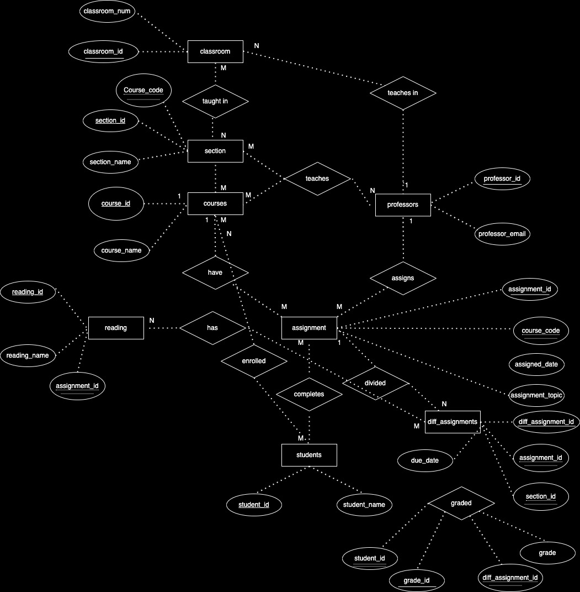

# Data Normalization and Entity-Relationship Diagramming

# University Database Design - 4NF Compliance

## Original Data Set

Here is a table containing the original data set:

| assignment_id | student_id | due_date | professor | assignment_topic                | classroom | grade | relevant_reading    | professor_email   |
| :------------ | :--------- | :------- | :-------- | :------------------------------ | :-------- | :---- | :------------------ | :---------------- |
| 1             | 1          | 23.02.21 | Melvin    | Data normalization              | WWH 101   | 80    | Deumlich Chapter 3  | l.melvin@foo.edu  |
| 2             | 7          | 18.11.21 | Logston   | Single table queries            | 60FA 314  | 25    | Dümmlers Chapter 11 | e.logston@foo.edu |
| 1             | 4          | 23.02.21 | Melvin    | Data normalization              | WWH 101   | 75    | Deumlich Chapter 3  | l.melvin@foo.edu  |
| 5             | 2          | 05.05.21 | Logston   | Python and pandas               | 60FA 314  | 92    | Dümmlers Chapter 14 | e.logston@foo.edu |
| 4             | 2          | 04.07.21 | Nevarez   | Spreadsheet aggregate functions | WWH 201   | 65    | Zehnder Page 87     | i.nevarez@foo.edu |
| ...           | ...        | ...      | ...       | ...                             | ...       | ...   | ...                 | ...               |
## Issues with 4NF Compliance

The original data set exhibits issues related to 4th Normal Form (4NF) compliance. Specifically:

- There are potential multivalued dependencies, especially concerning professors, sections, and assignments, for e.g the assignments topics are repeated. 
- Redundancies and update anomalies might arise due to the denormalized structure.

## Changes Made for 4NF Compliance

To achieve 4NF compliance, I made the following changes were made:

1. **Identification of Dependencies:**
   - Recognized functional dependencies and multivalued dependencies within the original data set.

2. **Normalization of Entities:**
   - Each entity (Student, Professor, Course, Section, Classroom, Assignment, Reading) was divided into different tables. 

3. **Introducing Surrogate Keys:**
   - Surrogate keys were introduced where necessary to ensure each table has a primary key.

4. **Establishing Relationships:**
   - Foreign keys were defined to establish relationships between entities.

## 4NF-Compliant Data Set

### Assignment Entity 

**Assignment Table:**
| assignment_id (primary key) | course_code (Foreign Key) | assignment_topic                | relevant_reading        |
|---------------|---------------------------|---------------------------------|-------------------------|
| 1             | WWH 101                   | Data normalization              | Deumlich Chapter 3      |
| 2             | 60FA 314                  | Single table queries            | Dümmlers Chapter 11     |
| 3             | 60FA 314                  | Python and pandas               | Dümmlers Chapter 14     |
| 4             | WWH 201                   | Spreadsheet aggregate functions | Zehnder Page 87         |
| 5             | CS 202                    | Database design principles      | Connolly Chapter 5      |
| 6             | 60FA 201                  | SQL fundamentals                | Atkinson Chapter 7      |

### Different assignment Entity 

**Section Sprecific Assignment Table:**

| assignment_instance_id (Primary Key) | assignment_id (Foreign Key) | section_id (Foreign Key) | assigned_date | due_date  |
|--------------------------------------|-----------------------------|---------------------------|---------------|-----------|
| 1                                    | 1                           | 1                         | 15.02.21      | 23.02.21  |
| 2                                    | 2                           | 2                         | 10.11.21      | 18.11.21  |
| 3                                    | 1                           | 3                         | 20.02.21      | 28.02.21  |
| 4                                    | 5                           | 2                         | 01.05.21      | 05.05.21  |
| 5                                    | 4                           | 1                         | 27.06.21      | 04.07.21  |

### Grade Entity 

**Grade Table:**
| grade_id (Primary Key) | assignment_instance_id (Foreign Key) | student_id (Foreign Key) | grade |
|------------------------|--------------------------------------|--------------------------|-------|
| 1                      | 1                                    | 1                        | 80    |
| 2                      | 2                                    | 7                        | 25    |
| 3                      | 3                                    | 4                        | 74  |
| 4                      | 4                                    | 2                        | 56  |
| 5                      | 5                                    | 2                        | 91  |

**Professor_Assignment Table (with Foreign Key):**

| assignment_id | professor_email     |
|---------------|----------------------|
| 1             | l.melvin@foo.edu     |
| 2             | e.logston@foo.edu    |
| 3             | i.nevarez@foo.edu    |
| 4             | l.melvin@foo.edu     |
| 5             | e.logston@foo.edu    |
| 6             | i.nevarez@foo.edu    |

### Professor Entity

**Professor Table:**
| professor_id | professor_email     | 
|--------------|----------------------|
| 1            | l.melvin@foo.edu     | 
| 2            | e.logston@foo.edu    |
| 3            | i.nevarez@foo.edu    |
| 4            | j.smith@foo.edu      |
| 5            | a.jones@foo.edu      |
| 6            | k.wilson@foo.edu     |               

### Student Entity

**Student Table:**

| student_id (Primary Key) | student_name  |
|--------------------------|--------------|
| 1                        | John Doe      |
| 2                        | Jane Smith    |
| 3                        | Robert Johnson|
| 4                        | Emily White   |
| 5                        | Michael Brown |
| 6                        | Sarah Miller  |

### Course Entity
**Course Table:**

| course_code (Primary Key) | course_name  |
|---------------------------|--------------|
| WWH 101                   | Database     |
| 60FA 314                  | Python       |
| CS 202                    | Algorithms   |
| 60FA 201                  | SQL Fundamentals |
| ECO 301                   | Microeconomics |
| PHY 202                   | Quantum Mechanics |

### Section Entity
**Section Table:**

| section_id (Primary Key) | course_code (Foreign Key) | professor_id (Foreign Key) | 
|--------------------------|---------------------------|-----------------------------|
| 1                        | WWH 101                   | 1                           | 
| 2                        | 60FA 314                  | 2                           | 
| 3                        | WWH 101                   | 3                           | 
| 4                        | CS 202                    | 4                           | 
| 5                        | BIO 101                   | 1                           | 

### Classroom Entity
**Classroom Table:**
| classroom_id (Primary Key) | classroom_num |
|----------------------------|----------------|
| A101                       | Room 101       |
| B205                       | Room 205       |
| C302                       | Room 302       |
| D110                       | Room 110       |
| E405                       | Room 405       |
| F201                       | Room 201       |

### Reading Entity
**Reading Table:**

| reading_id (Primary Key) | reading_name | assignment_id (Foreign Key) |
|--------------------------|--------------|-----------------------------|
| 1                        | Database     | 1                           |
| 2                        | Python       | 2                           |
| 3                        | SQL Basics   | 3                           |
| 4                        | Data Structures | 4                         |
| 5                        | Algorithms   | 5                           |
| 6                        | Statistics   | 6                           |

## Entity-Relationship Diagram (ERD)

[Entity-Relationship Diagram](images/digram.drawio)

